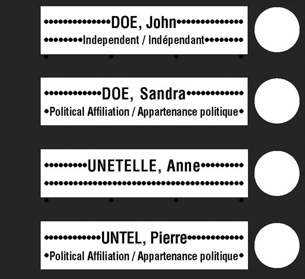
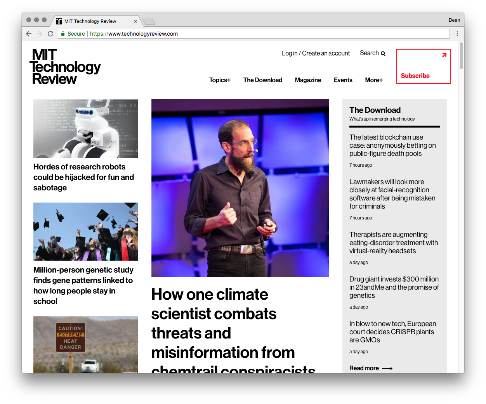

## A project to compare BC political parties, display party platforms, and find candidates.

My role in this project was **design** and **front-end development** working closely with a back-end developer.

## Problem Space

Leading up to the British Columbia provincial election on May 9th, 2017 there was no easy way to find candidates for a political riding.

We wanted to help inquisitive citizens find their candidates simply and quickly.

This idea came out of conversations with young voters who didn’t follow politics. Young adults are less likely to watch cable TV, and therefore local news programs, which would feature election coverage on a regular basis.

These millennial voters are more likely to look online for information to help them decide who to vote for, if they have decided to do research on the parties and the relevant issues.

## Persona

Our target user was a young millennial, mid 20's:

- Their first (or second) provincial election
- Cordcutter (no cable TV)
- Gets news from social media, internet savvy
- Beginning to take an interest in social issues
- Young career professional
- Living in the suburbs

## Ideation

The idea was to have an unbiased one-stop-shop to help get you up to speed on the election, inform your voting decision, and help you remember where and when to vote.

Initally we wanted to create a dashboard where our user could:

- compare party platforms and candidates,
- view important election issues,
- candidate stances on the issues,
- find ridings and voting places, and
- add the election day to their calendar.

The scope was ambitious given the hard deadline of an election day and we learned the hard way there is always a tradeoff between scope, budget, and time.

We found that our initial scope vastly outweighed our budget and schedule.

This was a side project done on evenings and weekends with a total budget of \$20 or less (domain registration mostly). This means we would not be able to contract a team or dedicate the hours ourselves to implement all of the features we wanted to see.

> Our budget and time constraints dictated that we reduce the initial scope.

We also found that other players in the space were already doing parts of our idea better, including party comparisons (Vote Compass) and election issues with party stances (ICAN). Both of these services have been around for multiple provincial elections and have had more time to refine their sites.

Our user would be better served by those sites, so we decided to focus on a more neglected area: finding the candidates. Prior to starting the project the only way to find a list of candidates was a PDF on the Election BC site.

We thought this would be a good place to begin improving the election research experience for our users.

## MVP

Throughout the project we knew we had to narrow the scope and focus on areas we could provide the most impact for our time investment.

The minimum viable product was a list of all candidates displayed in an table view. We then added a search filter allowing users to sort by riding, candidates, or political parties.

Before our time ran out, we were able to add:

1. An "Add to Calendar" button which downloaded a .ics file with the date and time of the election.
2. A couple of short articles written by our resident historian and political enthusiast @GustavoDestro on the importance of voting and a brief introduction to the B.C. parliamentary system

## Design

Having previously worked as an election official, I've grown to like the simplicity of the design on the ballots. The inspiration for the site's aesthetics came from the ballots we use. Here is a sample ballot from [elections.ca](http://www.elections.ca) :

I kept the colour scheme black and white to avoid any potential bias caused by using party colours. The `
` tags are dotted to mimic the perforations on the ballots.

I also took inspiration from the MIT Technology Review site which has clean typography, a distinct call to action button in the header, and clear information architecture.

## Setbacks and Solutions

Throughout the project we tried to balance speed, simplicity and responsive design.

The HTML table element was an easy solution for an MVP, and the first choice for our backend data to be displayed simply, but proved difficult to view on mobile.

To patch the display issues on smaller screens we ended up adding `table {overflow:scroll;}` in our CSS.

This provided a passable mobile experience but didn't get to the root of the problem: the table element is not easy to make responsive.

At this point in development we were forced to make a decision:

- continue to add functionality to the site at the expense of the mobile experience, or
- redo the backend with a database that would allow for more flexible display options?

We assumed that a site providing pre-election research utility would become virtually irrelevant after the election date, so we made the choice to keep the table. Learning experience!

## Lessons Learned

For next time, we would definitely change a couple of things:

#### 1. Delay coding until at least one round of a design sprint was completed.

When the idea was conceived, we got excited and introduced technical debt by not considering how difficult it would be to create responsive tables. By then we had done too much backend work to justify changing to a different paradigm. Next time, we would benefit from doing an initial design sprint to better understand our layout and ensure front-end and back-end needs are better aligned.

#### 2. Do more branding research before buying the domain name.

After we began building the product and hosted it on `www.bcvotes.info` we realized that CBC was prepending all of their pre-election coverage pages with “BC Votes“. This ensured our project would take a massive SEO hit and be buried under dozens of CBC articles, effectively putting us out of contention for the front page of a Google search. Next time, we would try and get a more unique name! I would love to see collaboration with a marketing or SEO specialist to better brand the product, be more visible to the target audience, and provide more people the opportunity to use the site.

#### 3. Better git workflows

At the time, both of us were new to using git for version control. Since this project was created, I personally have learned an incredible amount about using git to collaborate with other developers. Branching, issues, and pull requests are tools we didn't know we were missing at the time and would benefit from using next time.

## Conclusion

It was my first time collaborating with another developer for a side project. It was a great learning experience and taught me the importance of development practices I'd only read about before.

The site itself is not live at the moment, however I plan on hosting a static version with github pages at some point soon. The code is available to view on my github profile.
