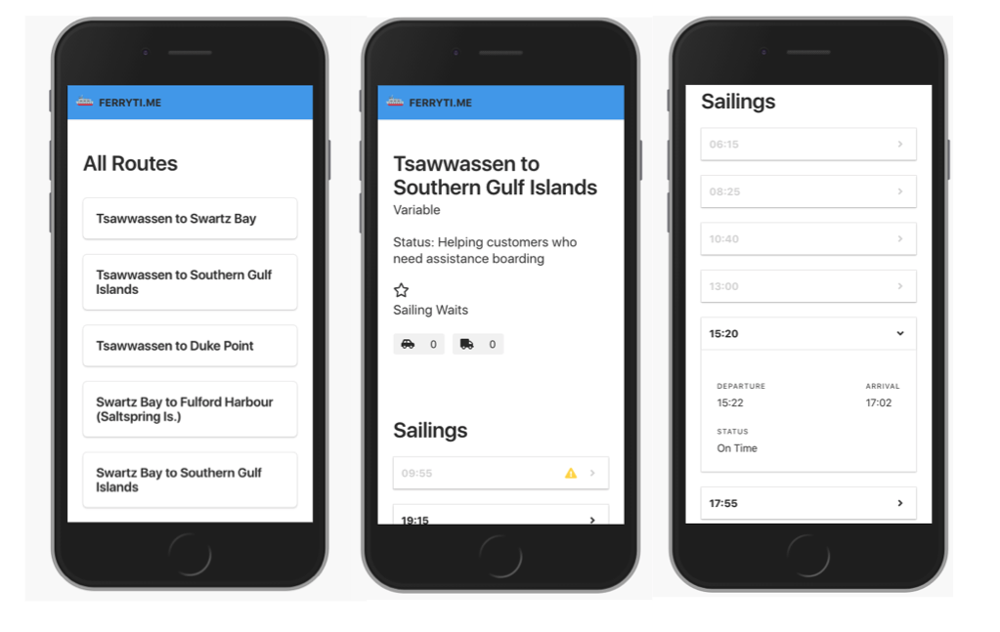

<!-- 
What You'll Do
Provide technical leadership to our Partner’s teams remotely and in-person -->

I'm excited to have the opportunity to apply to the **Intermediate Front-End Engineer** role! I think I'm a great fit for this position and would love to work alongside some of Vancouver's best designers and developers.

## Current Role

In my current role at [Loungeworks](http://loungeworks.ca), Western Canada's number one event rental company, I am the **technical lead** for Vancouver's warehousing and logistics teams and I have the unique responsibility of providing easy-to-follow instructions and guidance for the rest of the company when it comes to implementing new technologies, improving existing ones, and increasing day-to-day technical literacy. 

With a background in Psychology and Linguistics, and by bootstrapping my own Computer Science education, I have the **ability to communicate with both technical and non-technical audiences** and I love the challenge of explaining technical concepts to non-technical people through metaphors, diagrams, and analogies. 

In all of my roles I work hard to first understand the systems in place, why they exist, and for what purpose. Then I question the status quo and provide solutions where necessary to **improve customer experience** and **our internal processes**. 

<!-- I've advocated for moving critical infrastructure to cloud-based services to remove potential points of failure and decrease administrative time. I'm a vocal supporter of password managers and increasing digital security -->

<!-- Work with a diverse partner ecosystem to collaborate on project development best practices, architecture and design approaches with our product -->

<!-- Collaborate in code and design reviews with our Partners to create better solutions -->

<!-- Apply software development best practices from our Developer Values and Coding Style -->

<!-- Occasionally, travel to assist our customers and partners building on our platform -->

<!-- Spot rough edges across implementations and work with other teams to remove them -->

For example, I conducted internal research which found that our Account Management team was spending _multiple hours a week_ manually updating a calendar in their CRM for each event. After discovering this, I wrote [an application](https://github.com/deansallinen/flex-to-gcal) that would sync the inventory management system with the CRM through a shared Google Calendar. This allows for a fully customizable, shareable, simple interface to view upcoming orders and events. The challenge here was using a relatively undocumented API (in the inventory management software) and working around their unique data modelling practices. 

The end result saves each account manager _multiple hours_ every week and **reduced the number of mistakes** due to manual entry. An added benefit was integrating Slack notifications that would, for example, notify our warehouse when an order is ready to pull, or the logistics team when the event time has changed. This also **increased internal visibility** keeping remote teams in the loop, and **improved productivity** by not having to manually update each team's progress on an order!

Another rough edge I was able to remove: Every Monday our Logistics Manager would spend nearly the full day adding the week's orders to the crew/trucking schedule in a Google Sheet. I noticed this and wrote a custom report using SQL and a little bit of Java to integrate it with the inventory management software so he could select a date range and download a fully-formatted Excel document, with additional features such as deep linking to the individual documents, for all the logistics events in a given time period. 

Over the past year this has easily **saved the company over 400 hours** of his time!

<!-- Present feedback from the developer community to Product, Product Management and  the rest of the Mobify -->

<!-- Who You Are -->

<!-- You’re a strong communicator who loves to working in developer communities -->

<!-- You can explain technical concepts to audiences of varying skill levels -->

<!-- You have the tenacity to debug tricky problems that span multiple systems or vendors -->

<!-- You’ve worked on a team building and maintaining a web application -->

## Relevant Web Projects

I'm currently building **[Ferrytime](https://ferryti.me/)**: an alternative view for the BC Ferries schedule built as a **Progressive Web Application** using React.js, Gatsby, Node, and GraphQL (among other technologies). This stack allows for fast iteration, a light-weight result that's easy to deploy, and an application that can be used offline and immediately provide value to the user. 

This project resulted from my experiences commuting on the ferries, and visiting friends and family who live on the Sunshine Coast. The BC Ferries website is slow on mobile networks, is difficult to navigate (even for experienced users), and important information is spread across multiple pages (poor information architecture). With Ferrytime I wanted to address those pain points, so I built it to be **fast on slow 3G networks**, to show the schedule **even when offline**, make it **simple to navigate**, and collate all route information onto **a single page**. Initial user feedback has been very positive, and I'm continually making improvements!

I've also been developing a single-page CRUD app called [TastingNotes](https://www.tastingnotes.club/) [(Github)](https://github.com/deansallinen/tastingnotes) to learn **Lambda functions** and I have a static site in progress for a Brazilian client, [Brincao](https://brincao.netlify.com/) [(Github)](https://github.com/deansallinen/brincao), which has been instrumental in learning how to develop responsive experiences for **customers on slow, rural networks**. Also, take a look at my write up on the [Mailroom](/projects/mailroom) project to see me practising **TDD** while writing a **REST API** and communicating with a less-technical audience.

## Technologies

I spend most of my time creating frontends in **React** and backends in **Node** using Javascript (**ES6**) and **GraphQL**. 

I also use **Python** for writing quick problem-solving scripts, and combine it with **Numpy** and **Pandas** for data analysis, usually extracted using **SQL**. 

I'm teaching myself **ReasonML** (and ReasonReact) because I like functional programming, and can see the value in static typing, the safety of immutable data structures, and benefit of Ocaml's rich history. The compile speed of ReasonML combined with the JS interoperability means it's very likely to be a big player in the future of Front End development, so I'm starting now!

<!-- You’ve built a single page web app using a JavaScript framework like React.js -->

<!-- You have worked with 3rd party JavaScript like Optimizely or Google Analytics -->

<!-- You’re passionate about building great experiences for users on the web -->

<!-- You have a growth mindset and are open and willing to both accept and give feedback -->

<!-- You would enjoy occasionally leaving the office to visit a customer or partner onsite -->

## Contact Me

If you're as excited as I am about this potential opportunity, feel free to reach out! 

Send me an email at [deansallinen@gmail.com](mailto:deansallinen@gmail.com) and we can arrange a time to chat.

My code lives on [GitHub](https://www.github.com/deansallinen), and if you would like to read about other projects I've worked on, visit the rest of [my portfolio](/). 

 

#### Dean is an equal opportunity employee and encourages companies of all backgrounds and experience levels to interview him.

